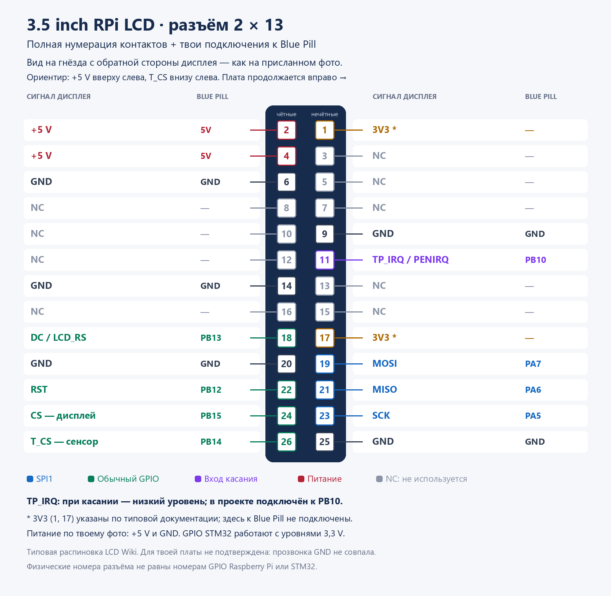

# Подключение и сборка экранчика

Плата: STM32F103C8T6, 64 КБ Flash и 20 КБ RAM. Экран ILI9486 320×480,
сенсор XPT2046 и W25Q16 используют SPI1 с раздельными CS.

Настройки выводов и периферии: `Firmware/BluePillHMI/BluePillHMI.ioc`.
Калибровка тача, адаптер LCD, период опроса и диагностический режим:
`Firmware/BluePillHMI/Config/project_config.h`. Здесь нет настроек конкретного GUI.

## Сборка

Keil uVision / Arm Compiler 6.19, пакет STM32F1xx, Python 3 и MinGW GCC для ресурсов.
`BUILD.cmd` вызывает генератор выбранного модуля и собирает target `ExternalFlash`.
Путь к Keil задаётся через `--keil` или `KEIL_UV4`; сборка запускается без повышения прав.
Готовые `display.hex` и `resources.bin` находятся в `Release/<имя модуля>/`.
Прошивку STM32 можно загрузить из Keil обычным Download; автоматическая сборка её не загружает.

## Загрузка ресурсов

`START.cmd` запускает общий UART-загрузчик (Python 3.7, PySide2, pyserial).
Он читает путь к образу из `module.json`; содержимое проверяет модуль на STM32.
UART1: 115200, 8N1. `PCHR` — программный сброс, `PCHW` — вход в загрузчик после сброса.
Это неизменённые транспортные сигнатуры загрузчика, не протокол конкретного GUI.
При смене модуля сначала требуется совместимая прошивка, затем его образ ресурсов.

## Диагностика

`LCD_TEST_PATTERN=1` включает цветные полосы и отметку касания без запуска GUI.
`app_debug` содержит этап загрузки, счётчики LCD, сырые и экранные координаты тача,
состояние SPI, Flash и UART-загрузчика. Светодиод PC13 после запуска переключается каждые 500 мс.
Стартовая консоль использует внутренний шрифт и сообщает ошибки ресурсов до запуска GUI.

## Подключение

[Векторная схема](lcd-connector-pinout.svg). Подписи Blue Pill берутся из `.ioc`;
после переназначения пинов схему можно обновить командой `python Scripts/Build/draw_pinout.py`
(нужен Pillow; шрифты Segoe UI, путь к папке задаётся `PINOUT_FONT_DIR`).

| Сигнал | Blue Pill |
|---|---|
| LCD и XPT2046 SCK | PA5, SPI1 |
| LCD и XPT2046 MOSI | PA7 |
| XPT2046 MISO | PA6 |
| LCD CS | PB15 |
| LCD DC | PB13 |
| LCD RST | PB12 |
| XPT2046 T_CS | PB14 |
| XPT2046 PENIRQ | PB10, вход с подтяжкой |
| Внешняя Flash SCK / DO / DI | PA5 / PA6 / PA7, общая SPI1 |
| Внешняя Flash CS | PA4 |
| UART TX / RX | PA9 / PA10, 115200 8N1 |
| Отладка SWDIO / SWCLK | PA13 / PA14 |

Общая земля обязательна. Плата дисплея на приложенном фото питается от обозначенного +5V;
сигналы STM32 — 3,3 В. Внешняя Flash — **3,3 В**, например W25Q80DV/JV (1 МБ),
с подтянутыми к 3,3 В /WP и /HOLD и конденсатором 100 нФ у питания.
SPI2 отключена: PB12–PB15 заняты управляющими GPIO дисплея и сенсора.

Для имеющейся **W25Q16JV, 8 выводов**, нумерация по виду сверху от точки вывода 1:

| Вывод Winbond | Подключение |
|---|---|
| 1 — /CS | PA4; желательно 10 кОм к 3,3 В |
| 2 — DO / MISO | PA6 |
| 3 — /WP | 10 кОм к 3,3 В |
| 4 — GND | Общая земля |
| 5 — DI / MOSI | PA7 |
| 6 — CLK | PA5 |
| 7 — /HOLD | 10 кОм к 3,3 В |
| 8 — VCC | 3,3 В |

100 нФ между выводами 8 и 4 рядом с микросхемой. PA5–PA7 подключаются параллельно
к тем же линиям LCD/сенсора; /CS памяти отдельный. Распиновка:
[даташит W25Q16JV](https://stm32-base.org/assets/pdf/devices/W25Q16JV.pdf).
Ёмкость 2 МБ достаточна для полного файла ресурсов. После подключения выполнить
раздел ниже «Внешние ресурсы без отдельного SPI-программатора».

SPI1: 18 МГц для дисплея и внешней Flash; при чтении сенсора временно переключается на 1,125 МГц.
Все три устройства подключены к общей SPI1 с отдельными CS, начальное состояние CS — высокое.
Обмен выполняется последовательно в основном цикле; частоту можно снизить в CubeMX.

Драйвер предполагает **ILI9486 + Raspberry Pi SPI-переходник**, как у типичных модулей
3.5 inch RPi LCD V3.0. Маркировка платы сама по себе не подтверждает контроллер.
В `Config/project_config.h` выбран `LCD_RPI_ADAPTER=1`: регистры передаются по 16 тактов,
пиксели — RGB565. Для голого ILI9486 SPI предусмотрено `LCD_RPI_ADAPTER=0` с RGB666 на проводе.
Для другого LCD-контроллера потребуется его последовательность инициализации в `board.c`.
Формат передачи сверялся с [TFT_eSPI Generic](https://github.com/Bodmer/TFT_eSPI/blob/master/Processors/TFT_eSPI_Generic.h),
регистры — с [ILI9486 Init](https://github.com/Bodmer/TFT_eSPI/blob/master/TFT_Drivers/ILI9486_Init.h).

У типового [3.5inch RPi Display](https://www.lcdwiki.com/3.5inch_RPi_Display)
TP_IRQ выведен на физический контакт 11 разъёма. На присланной картинке он не подписан.
Подтверждённый контакт TP_IRQ соединяется с PB10 STM32; это обычный вход, в коде опрашивается уровень.
При касании уровень низкий. Распиновка модуля пока не подтверждена: сообщённая прозвонка GND не совпала с типовой схемой. Разводку конкретной ревизии нужно проверить прозвонкой
до PENIRQ XPT2046. Без этой линии нынешний драйвер не обнаруживает нажатие.
